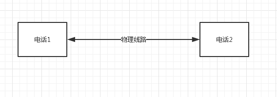
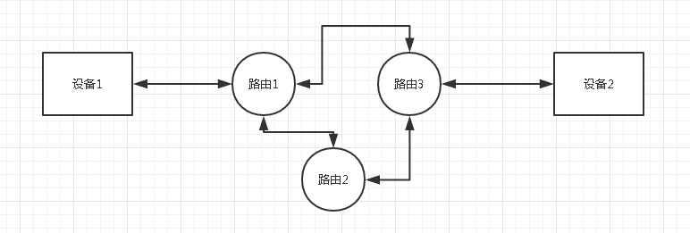
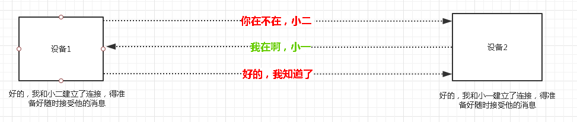

## ”TCP连接“究竟是什么意思？

> 我们经常听到"建立TCP连接"，"服务器的连接数量有限"等，但仔细一想，连接究竟是个什么东西，是和电话一样两端连起一根线？似乎有点抽象不是么？

### 1. 久违的分组交换网络

似乎这个概念只有在学校里学计算机网络才能接触到，但不过今天的话题其实和它离不开关系。我们知道最早的电话网络是以很容易理解的形式存在的，就是单纯的一根线加两端的设备，设备之间所沟通的所有信息都通过一根特定的电缆来回传输，如下图：

这样的连接是我们特别好理解的，搭起两边的线，就是一个连接嘛！但是，我们讨论的是计算机网络！(严肃脸)，计算机网络中两个设备节点是如何通信？

计算机网络采取分组交换技术，什么意思呢？就是我有【一块数据】要发给对方小苍，那我会把这【一块数据】分成N份【单位数据】，分别发出去，而每份【单位数据】走哪条路是不一定的，但是这些【单位数据】总要全部达到小苍手里，小苍再根据【单位数据】里记录的序号拼接起来，组成完整的【一块数据】。这就是分组的意思所在。

### 2. 协议和协议实现

上面不小心把TCP的大体实现给说了，实际上在具体的应用中，光有大体思路是不行的，还有很多细节问题，需要两个设备之间提前约定好协议，才能协同完成通信。举个例子：A向B发了10份【单位数据】，而B其实只收到9份【单位数据】，怎么办？

TCP协议大家都应该是知道的，但协议只是想法，真正起作用的是在路由节点和设备节点上的协议软件，是运行在设备上的具体执行者，它根据协议指导，对具体数据进行控制和操作。这儿就不往下展开了。

认识到协议和协议软件这一点非常重要，因为连接的限制恰恰就是受软件在设备中资源分配的影响的。

### 3. 连接的真面目

上面说的第一种电话网络，如果两个设备搭设了一条线，那么两个电话就一定确定对方在线，因为他俩独享一条实时存在的线。但计算机网络的连接呢？

向上面的图一样*(图里不深究TCP，仅仅用来说明连接大体过程)*，其实他们俩并不能确保对方就是在线，只是通过几番确认，**认为**对方一直会在。而如果确认了对方存在，那么就会为以后的对话通讯分配内存、CPU处理时间等资源，每个设备都会在本地去维持这么一个状态，来告诉自己是有一个连接的，这些设备所花的资源和维护的状态，而整个网络是不会记录有着一条连接的，所以说连接只是记录在各个设备的一个状态信息。

那么，到现在我们知道了，连接其实并不是所谓的有一根电线连起两个设备，而是两方确认了一下对方的存在后，自己在本地记录的状态。那么下面可以讨论一下以前迷惑重重的概念了。

### 4. 为什么服务器都有连接数量的限制？

这里只做讨论。我认为是有两点：

- 物理带宽的限制，决定了一个时间段内发起连接的数据包不会超过某个数，造成了设备的链接数量的限制。
- 维持连接需要分配内存等资源，设备的资源有限，决定了一定有个最大连接数的极限。

### 5. 待续

通过连接往外延伸的话题不少，先到此为止吧，有时间再补。

